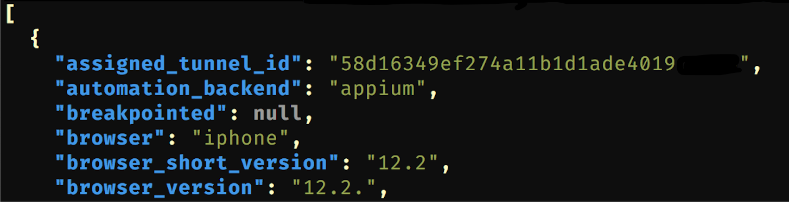

# saucers

A command line utility to interface with the saucelabs API.

It is expected that you already have the environment variables SAUCE_USERNAME and SAUCE_ACCESS_KEY set in your command line environment. 

For Mac and Linux, you probably want to set these variables in your .bashrc or .zshrc.

For Windows, this can be set in Start | System Information | System Properties | Advanced System Settings | Advanced (tab) and click the "Environment Variables..." button.

Your 'username' and 'access_key' can be found here [https://app.saucelabs.com/user-settings](https://app.saucelabs.com/user-settings)

## Help

`saucers --help`

```text
saucers 0.9
Saucelabs api util.
IMPORTANT: This program expects you to have already set your saucelabs credentials in the environment variables
SAUCE_USERNAME and SAUCE_ACCESS_KEY (e.g in your .bashrc or .zshrc, or Windows system properties)

USAGE:
    saucers [SUBCOMMAND]

FLAGS:
    -h, --help       Prints help information
    -V, --version    Prints version information

SUBCOMMANDS:
    apistatus    Get the current saucelabs API status.
    assetfile    Get a file asset associated with a particular job ID. (logs, screenshots, etc.) See the 'assetlist'
                 subcommand.
    assetlist    Get the asset list associated with a particular job ID
    help         Prints this message or the help of the given subcommand(s)
    job          Get data about a particular job ID.
    jobs         Get a list of jobs data.
    upload       Upload a file to your accounts sauce storage.
    uploads      Get a list of files that have been uploaded to sauce storage.
```

Written in Rust. #rustlang

## Usage Examples

List (at max) the last five jobs started on Saucelabs. The output is raw JSON, so is not pretty, but useful to pipe to another command, or store for another app to use.

`saucers jobs -m 5`

```json
[{"assigned_tunnel_id":"09fxxxe33bf843axxx63e57d244ff03d","automation_backend":"appium","breakpointed":null,"browser":"iphone","browser_short_version":"12.2","browser_version":"12.2.","build":"ExampleJobName","command_counts":null,"commands_not_successful":0,"consolidated_status":"in progress","container":false,"creation_time":1582650601,"custom-data":null,"deletion_time":null,"end_time":null,"error":null,"id":"0f511bd9e69e41e297eba599d29cxxxx","log_url":"https://assets.saucelabs.com/jobs/0f511bd9e69e41e297eba599d29cxxxx/selenium-server.log","modification_time":1582650602,"name":null,"os":"Mac 10.14","owner":"exampleOwner","passed":null,"performance_enabled":null,"proxied":true,"proxy_host":"10.119.25.77","public":"team","record_screenshots":true,"record_video":true,"start_time":1582650602,"status":"in progress","tags":["stage","ios","20200214.7","02/25/2020 04:58:09 pm"],"video_url":"https://assets.saucelabs.com/jobs/0f511bd9e69e41e297eba599d29cxxxx/video.flv"},{"assigned_tunnel_id":"ba56584d6b334e118100746eb0e477db","automation_backend":"appium","breakpointed":null,"browser":"iphone","browser_short_version":"12.2","browser_version":"12.2.","build":"ExampleJobName","command_counts":null,"commands_not_successful":0,"consolidated_status":"in progress","container":false,"creation_time":1582650587,"custom-data":null,"deletion_time":null,"end_time":null,"error":null,"id":"0f511bd9e69e41e297eba599d29cxxxx","log_url":"https://assets.saucelabs.com/jobs/0f511bd9e69e41e297eba599d29cxxxx/selenium-server.log","modification_time":1582650588,"name":null,"os":"Mac 10.14","owner":"exampleOwner","passed":null,"performance_enabled":null,"proxied":true,"proxy_host":"10.119.49.230","public":"team","record_screenshots":true,"record_video":true,"start_time":1582650587,"status":"in progress","tags":["stage","ios","20200214.7","02/25/2020 04:58:09 pm"],"video_url":"https://assets.saucelabs.com/jobs/0f511bd9e69e41e297eba599d29cxxxx/video.flv"},{"assigned_tunnel_id":"d42054b285d54d528ca42546191b02a7","automation_backend":"appium","breakpointed":null,"browser":"android","browser_short_version":"8.0","browser_version":"8.0.","build":"ExampleJobName","command_counts":null,"commands_not_successful":0,"consolidated_status":"in progress","container":false,"creation_time":1582650579,"custom-data":null,"deletion_time":null,"end_time":null,"error":null,"id":"0f511bd9e69e41e297eba599d29cxxxx","log_url":"https://assets.saucelabs.com/jobs/0f511bd9e69e41e297eba599d29cxxxx/selenium-server.log","modification_time":1582650602,"name":null,"os":"Linux","owner":"exampleOwner","passed":null,"performance_enabled":null,"proxied":true,"proxy_host":"10.119.41.101","public":"team","record_screenshots":true,"record_video":true,"start_time":1582650582,"status":"in progress","tags":["stage","android","20200214.1","02/25/2020 04:51:17 pm"],"video_url":"https://assets.saucelabs.com/jobs/0f511bd9e69e41e297eba599d29cxxxx/video.flv"},{"assigned_tunnel_id":"09fxxxe33bf843axxx63e57d244ff03d","automation_backend":"appium","breakpointed":null,"browser":"iphone","browser_short_version":"12.2","browser_version":"12.2.","build":"ExampleJobName","command_counts":null,"commands_not_successful":0,"consolidated_status":"in progress","container":false,"creation_time":1582650572,"custom-data":null,"deletion_time":null,"end_time":null,"error":null,"id":"0f511bd9e69e41e297eba599d29cxxxx","log_url":"https://assets.saucelabs.com/jobs/0f511bd9e69e41e297eba599d29cxxxx/selenium-server.log","modification_time":1582650597,"name":null,"os":"Mac 10.14","owner":"exampleOwner","passed":null,"performance_enabled":null,"proxied":true,"proxy_host":"10.119.25.77","public":"team","record_screenshots":true,"record_video":true,"start_time":1582650572,"status":"in progress","tags":["stage","ios","20200214.7","02/25/2020 04:58:09 pm"],"video_url":"https://assets.saucelabs.com/jobs/0f511bd9e69e41e297eba599d29cxxxx/video.flv"},{"assigned_tunnel_id":"09fxxxe33bf843axxx63e57d244ff03d","automation_backend":"appium","breakpointed":null,"browser":"iphone","browser_short_version":"12.2","browser_version":"12.2.","build":"ExampleJobName","command_counts":null,"commands_not_successful":0,"consolidated_status":"in progress","container":false,"creation_time":1582650568,"custom-data":null,"deletion_time":null,"end_time":null,"error":null,"id":"0f511bd9e69e41e297eba599d29cxxxx","log_url":"https://assets.saucelabs.com/jobs/0f511bd9e69e41e297eba599d29cxxxx/selenium-server.log","modification_time":1582650590,"name":null,"os":"Mac 10.14","owner":"exampleOwner","passed":null,"performance_enabled":null,"proxied":true,"proxy_host":"10.119.25.77","public":"team","record_screenshots":true,"record_video":true,"start_time":1582650569,"status":"in progress","tags":["stage","ios","20200214.7","02/25/2020 04:58:09 pm"],"video_url":"https://assets.saucelabs.com/jobs/0f511bd9e69e41e297eba599d29cxxxx/video.flv"}]
```

Same command, piped through `jq` to get pretty printing of the js. I _really_ like [jq](https://stedolan.github.io/jq/) for command line formatting and manipulation of JSON.

`saucers jobs -m 5 | jq .`



Example use of the `-o` formatting of output. You can omit the parentheses around the final params below IF there are no spaces in the params.

`saucers uploads -o "name,size"`

```
name                     size
-----------------------------------
Android_20200214.1.apk   108550234
Android_20200219.1.apk   108227531
Android_20200219.3.apk   108227749
Android_20200220.2.apk   134294213
Android_20200214.1.apk   131756509
```


## Downloads

[MacOS](https://github.com/robertarles/saucers/raw/master/bin/macos/saucers)

[linux](raw/master/bin/linux/saucers)

[windows](raw/master/bin/windows/saucers.exe)
